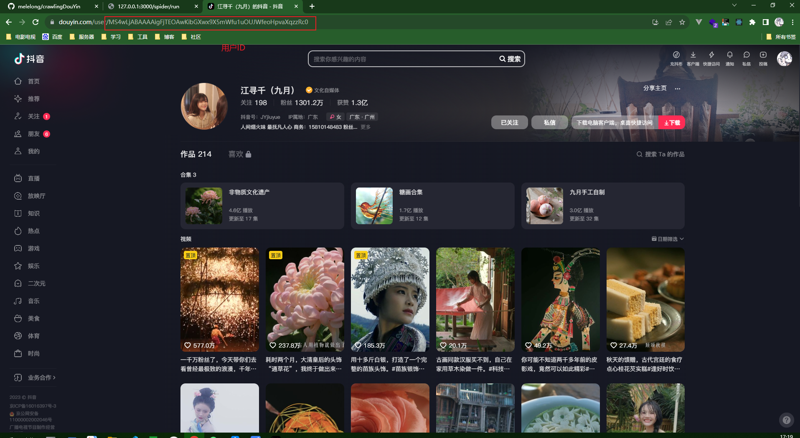

# Nest + puppeteer（爬取抖音个人页面）

## Node 版本

> > > Node v18.18.2

## 安装教程

```shell
npm install
```

## 使用说明

```shell
npm run start
```

浏览器输入：http://127.0.0.1:3000/spider/run?userId=用户的ID&type=download

默认不下载视频，下载视频需要传type=download
爬取结果在res目录下,json目录存储爬取结果，img目录存储爬取截图，mp4目录存储下载的视频
会弹出一个测试浏览器，有中间页验证码会卡住，这是要点验证码后续就可以继续爬取
ps:抖音的视频路径有时效性

